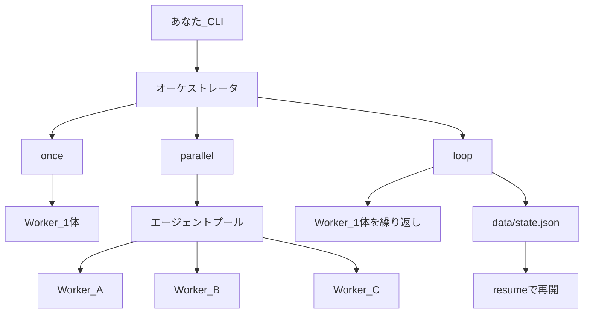

# multi-agent-orchestrator

Cursor の AI エージェントを **複数同時** に動かす、または **1体を上限つきで自律的に動かし続ける** ための CLI オーケストレータです。

GitHub ポートフォリオ向けのひな形として、仕組みが説明しやすい最小構成にしています。

---

## できること（3モード）

| コマンド | 何をするか |
|---|---|
| `once` | 1体のエージェントに、1回だけタスクを渡す |
| `parallel` | 複数のエージェントを **同時** に起動して、別々のタスクを実行する |
| `loop` | 1体にタスクを繰り返し送り、回数／時間の上限で止める |

### 用語（初学者向け）

| 用語 | 意味 |
|---|---|
| **オーケストレータ** | 「どの AI に何をさせるか」を管理する司令塔（このリポジトリ） |
| **Worker** | 実際に作業する 1体の Cursor エージェント |
| **自律ループ** | 同じエージェントへ「次の作業」を繰り返し送るモード |
| **resume** | 前回の `agentId` を読んで、会話を続きから再開すること |
| **`npm run ... --`** | `--` の後ろは npm ではなく、この CLI への引数として渡す区切り |

---

## アーキテクチャ



ポイント:

- **並列** = 複数の `Agent.create`（1体に同時に2本投げない）
- **継続** = 同じエージェントへ `send` を繰り返す
- **再開** = `data/state.json` の `agentId` を `Agent.resume` する

---

## 必要なもの

1. **Node.js 20 以上**
2. **Cursor API キー**  
   [Cursor Dashboard → Integrations](https://cursor.com/dashboard/integrations) で取得
3. Cursor の利用枠（API 呼び出しには課金／枠があります）

---

## セットアップ

```bash
# 1. 依存関係
npm install

# 2. 環境変数ファイルを作る
# Windows (cmd / PowerShell)
copy .env.example .env

# macOS / Linux
cp .env.example .env

# 3. .env を開き、CURSOR_API_KEY=... を自分のキーに書き換える
#    ※ 本物のキーは .env だけに書く。.env.example には書かない
```

任意の環境変数:

| 変数 | 意味 | 既定 |
|---|---|---|
| `CURSOR_API_KEY` | API キー（必須） | なし |
| `CURSOR_MODEL` | 使うモデル ID | `composer-2.5` |
| `AGENT_CWD` | エージェントが作業するフォルダ | カレントディレクトリ |

型チェック:

```bash
npm run typecheck
```

### Windows PowerShell 補足

`npm` で実行ポリシーエラーが出る場合は `npm.cmd` を使ってください。

```powershell
npm.cmd run agent -- once "こんにちは。短く返答して。ファイルは変えないで"
```

---

## 使い方

### 1. 単発 (`once`)

```bash
npm run agent -- once "このリポジトリの構成を短く説明して。ファイルは変えないで"
```

### 2. 並列 (`parallel`)

```bash
npm run agent -- parallel examples/tasks.sample.json
```

サンプル (`examples/tasks.sample.json`) は次の3タスクを同時に実行します。

| id | 内容 |
|---|---|
| `docs` | README の分かりにくい点を指摘（読み取り専用） |
| `structure` | `src/` 各ファイルの役割を要約（読み取り専用） |
| `safety` | ループ停止条件の場所を報告（読み取り専用） |

タスクファイルの形:

```json
{
  "tasks": [
    { "id": "docs", "prompt": "..." },
    { "id": "structure", "prompt": "..." }
  ]
}
```

### 3. 自律ループ (`loop`)

```bash
# 最大 3 回、最大 15 分
npm run agent -- loop --max-steps 3 --max-minutes 15 "小さな改善を続けて。危険な変更はしないで"

# 前回の続きから再開（data/state.json の agentId を使う）
npm run agent -- loop --resume --max-steps 2 "前回の続きをして"
```

停止条件（暴走防止）:

- `--max-steps` … 最大ステップ数（既定 5）
- `--max-minutes` … 最大分数（既定 30）
- **Ctrl+C** … 実行中の run をキャンセルして終了

`data/state.json` にはだいたい次のような情報が入ります（コミットされません）。

```json
{
  "agentId": "agent-....",
  "mode": "loop",
  "lastPrompt": "...",
  "step": 2,
  "updatedAt": "2026-07-16T...",
  "lastRunId": "run-....",
  "lastStatus": "finished"
}
```

---

## 実行ログ例

### once（成功）

```text
> npm run agent -- once "こんにちは。短く返答して。ファイルは変えないで"

[once] agent=agent-26be2163-... run=run-36768115-...
こんにちは。何か手伝えることがあれば、短く答えます。
[once] worker=once | agent=agent-26be2163-... | run=run-36768115-... | status=finished | durationMs=6191
```

### parallel（3 Worker 同時）

```text
> npm run agent -- parallel examples/tasks.sample.json

[parallel] 3 タスクを同時実行します
[pool] created docs -> agent-ec294707-...
[pool] created structure -> agent-1f2f6d24-...
[pool] created safety -> agent-ed38f880-...
[docs] agent=... run=...
[structure] agent=... run=...
[safety] agent=... run=...
...（各 Worker の回答がストリーム表示）...
[pool] done worker=structure | status=finished | durationMs=10321
[pool] done worker=docs | status=finished | durationMs=13528
[pool] done worker=safety | status=finished | durationMs=20462
```

### キー未設定（エラー例）

```text
エラー: CURSOR_API_KEY が設定されていません。
1. https://cursor.com/dashboard/integrations で API キーを取得
2. .env.example を .env にコピーして CURSOR_API_KEY=... を記入
```

---

## ディレクトリ構成

```text
.
├── src/
│   ├── index.ts          # CLI 入口（引数解析・ヘルプ）
│   ├── config.ts         # 環境変数・.env 読み込み
│   ├── orchestrator.ts   # once / parallel / loop の司令塔
│   ├── pool.ts           # 複数 Agent の同時実行
│   ├── loop.ts           # 自律ループ（上限・resume）
│   ├── state.ts          # state.json の読み書き
│   ├── agentRunner.ts    # Agent 作成・送信・ストリーム・破棄
│   └── types.ts          # 型定義
├── examples/
│   └── tasks.sample.json # 並列用サンプル（読み取り専用タスク）
├── data/                 # 実行時の状態（コミットしない）
├── .env.example          # 環境変数の見本（本物のキーは書かない）
├── AGENTS.md             # AI エージェント向けの短い地図
├── SECURITY.md           # API キー取り扱い
├── LICENSE               # MIT
└── README.md
```

---

## 終了コード

| コード | 意味 |
|---|---|
| `0` | 成功 |
| `1` | 起動前エラー（キー未設定、設定ミス、`CursorAgentError` など） |
| `2` | 実行は始まったが run が失敗 |
| `130` | Ctrl+C などでキャンセル |

---

## これから（ロードマップ）

このリポジトリは **ひな形（Phase 1）を公開済み** です。

1. ~~Phase 2 — README / デモを整え、GitHub に公開~~（進行中: ログ例・図を追加。デモ gif は任意）
2. **Phase 3** — 「既存リポジトリを直す」ではなく、**新しい小さなプロジェクトを作って GitHub に公開**するモードを追加し、リポジトリ数を増やせるようにする

空のリポジトリを量産すると逆効果なので、Phase 3 では「小さな完成デモ付き」を原則にします。

---

## 注意

- API キーを Git にコミットしないでください（`.env` は ignore 済み）
- ループは必ず上限付きで使ってください（課金・枠に注意）
- 最初は `once` の読み取り専用プロンプトで動作確認するのが安全です

---

## ライセンス

MIT（[LICENSE](LICENSE)）
